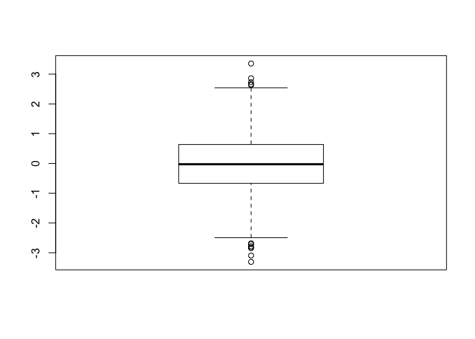
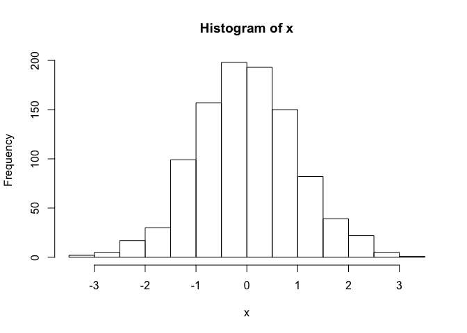
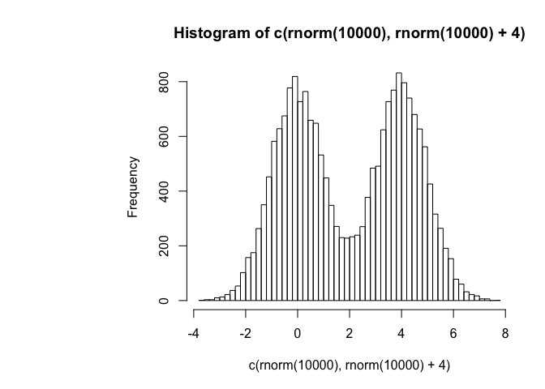
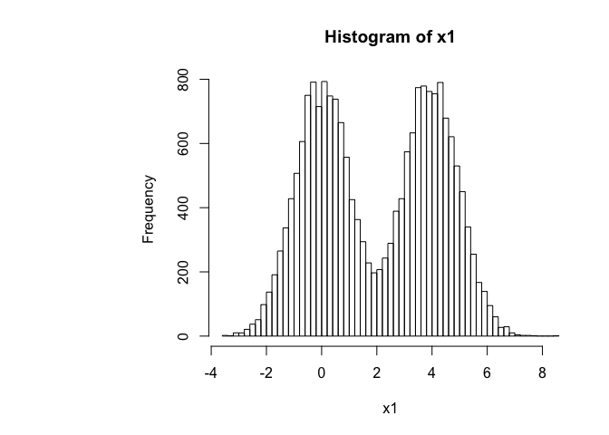

Class 5 Introduction to R Graph Design
================
Tingyi Yang
Jan 22nd, 2019

Class 05 R graphics intro
=========================

This is some **bold** and *italic* text and `code`

``` r
# My first boxplot

x <- rnorm(1000,0)
boxplot(x)
```



``` r
#rnorm is executed first then boxplot

summary(x)
```

    ##     Min.  1st Qu.   Median     Mean  3rd Qu.     Max. 
    ## -2.97191 -0.70774 -0.02662 -0.01866  0.61580  2.99073

``` r
hist(x)
```



``` r
boxplot(x, horizontal = TRUE)
```


I have generated x and it has `length(x)`

``` r
#hands on session 2

y <- read.table("bimm143_05_rstats/weight_chart.txt", header = TRUE)
plot(y, type="o", pch=15, cex=1.5, lwd=3, lty=3, ylim=c(2,10), xlab="Age(months)", ylab="Weight(kg)", main = "Weight with Age")
```


``` r
# try a barplot

barplot(VADeaths, beside=TRUE)
```


``` r
barplot(VADeaths, beside=FALSE)
```


``` r
#Input the feature count data

z<- read.table("bimm143_05_rstats/feature_counts.txt", sep = "\t", header = TRUE)
par(mar=c(5.1,12,4.1,2.1))
barplot(z$Count, horiz = TRUE, main ="mouse versus feature counts", las=2, xlim= c(0,80000), names.arg = z$Feature)
```


``` r
#

hist(c(rnorm(10000),rnorm(10000)+4), breaks = 80)
```



``` r
x1 <- c(rnorm(10000),rnorm(10000)+4)
hist(x1, breaks=80)
```



``` r
#section 3

m <- read.table("bimm143_05_rstats/male_female_counts.txt", header = TRUE, sep="\t")
par(mar=c(5.1,4,4.1,2.1))
barplot(m$Count, names.arg = m$Sample, las=2, col=rainbow(10), ylab="counts")
```


``` r
#all barplots need height!!!!!! it is m$Count this time

#
genes <- read.table("bimm143_05_rstats/up_down_expression.txt", header=TRUE, sep="\t")
#how many genes in the table
nrow(genes)
```

    ## [1] 5196

``` r
#how many up down and all round
table(genes$State)
```

    ## 
    ##       down unchanging         up 
    ##         72       4997        127

``` r
#plot
palette(c("cyan", "magenta", "blue"))
plot(genes$Condition1,genes$Condition2,col=genes$State)
```


``` r
#
meth <- read.table("bimm143_05_rstats/expression_methylation.txt", header = TRUE, sep = "\t")
nrow(meth)
```

    ## [1] 9241

``` r
plot(meth$gene.meth, meth$expression)
```


``` r
#another way to read the table
meth2 <- read.delim("bimm143_05_rstats/expression_methylation.txt")
dencol <- densCols(meth$gene.meth, meth$expression)

plot(meth$gene.meth, meth$expression, col=dencol, pch=20)
```


``` r
inds <- meth$expression > 0
plot(meth$gene.meth[inds], meth$expression[inds])
```


